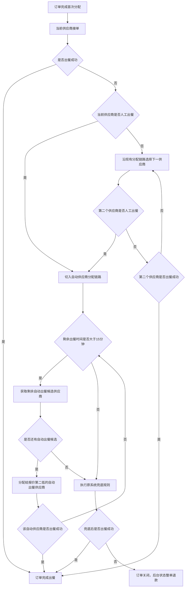

# 【订单分配规则优化】产品需求文档（PRD）
> 文档状态：已保存基线
> 当前版本：V1.4
> 基线文件：C:\Users\Lenovo\Documents\点餐\订单分配规则优化-PRD.md
> 上次更新时间：2026-07-02 17:12:20
> 本次变更摘要：补充每轮分配前的剩余出餐时间判断：剩余出餐时间大于15分钟时继续按分配规则流转，小于等于15分钟时直接进入兜底规则；同时优化预览版流程图显示尺寸。
> 在线编辑入口：本地文件：C:\Users\Lenovo\Documents\点餐\订单分配规则优化-在线编辑器.html；本地预览地址：http://127.0.0.1:8765/订单分配规则优化-在线编辑器.html
> 协作方式：优先使用本地预览地址进行在线编辑；在线编辑器用于查看、新增、删除、修改、保存在线编辑、导出 Markdown，并支持绑定正式基线后持续迭代；当前 md 文件为已保存基线版本，后续由 Codex 基于该基线继续更新。

## 1. 需求背景
### 1.1 需求背景
已知：当前点餐系统订单分配遵循“价低者得”的基础原则。供应商存在 `人工出餐` 和 `自动出餐` 两种出餐方式，且同一笔订单中，同一供应商仅会对应一种出餐方式。

若一笔订单连续好几轮都是人工出餐且大部分都失败了，就会造成出餐很慢的情况。
- 为提升出餐时间，**分配订单逻辑改为**：若一笔订单中，有一个人工出餐没有成功的，接下来这笔订单就不会分配给人工出餐，全部给到自动出餐

### 1.2 本次需求变更点
- 一笔订单中，若出现人工出餐“未成功”的情况，继续分配该订单时，分配给自动出餐的供应商【分配时，依旧遵循“价低者得”的情况】
- 若所有自动供应商都没有出餐成功，则走原系统 `兜底规则`【原有规则】
- 若兜底规则执行后仍没有出餐成功，则订单关闭，后台状态为 `整单退款`【原有规则】
- 一级供应商、二级供应商均适用同一规则

## 2. 需求更改
- 修改 `人工出餐未成功` 后的后续分配规则
- 修改后的逻辑，适用于 `一级供应商` 与 `二级供应商`

## 3. 业务流程

## 4. 核心业务规则
### 4.1 首次分配规则
1. 首次订单分配仍按原系统规则执行，遵循“价低者得”。
2. 本次需求不修改首次竞价和首次中单逻辑。

### 4.2 触发条件
1. 当整个订单分配流程中的任意一轮承接供应商为 `人工出餐`，且其 `未出餐成功` 时，触发本次新规则。
2. “未出餐成功”包括但不限于：`超时未处理`、`出餐失败` 等未完成成功出餐的状态。
3. 一旦系统判定某一轮人工出餐供应商未成功，后续该订单不再继续分配给人工出餐供应商，优先进入自动出餐供应商分配逻辑。

### 4.3 出餐方式规则
1. 同一笔订单下，同一供应商只会存在一种出餐方式，不会同时既是人工又是自动。
2. 本次规则强调：一旦人工出餐未成功，后续继续分配时不再回到人工出餐链路。

### 4.4 二次分配及后续分配规则
1. 整个订单分配流程中，当前接单供应商可能为 `人工出餐`，也可能为 `自动出餐`。
2. 若某一轮当前接单供应商为 `人工出餐` 且未出餐成功，则从该轮开始，订单后续继续分配时不再分配给人工出餐，优先进入自动出餐供应商链路。
3. 进入自动出餐供应商链路后，系统在剩余候选供应商中优先筛选  报价低的`自动出餐供应商`。
4. 每轮继续分配订单前，系统都需要先判断 `剩余出餐时间是否大于15分钟`。【原有逻辑】
5. 若剩余出餐时间 `大于15分钟`，则继续执行自动出餐供应商分配逻辑。
6. 若剩余出餐时间 `小于等于15分钟`，则不再继续分配，直接进入原系统现有的 `兜底规则`。【原有逻辑】
7. 若多个相同报价的自动出餐供应商同时符合接单条件时，随机分配。
8. 若被分配的自动出餐供应商仍未出餐成功，则继续按同样规则顺位流转给下一个 `报价第二低的自动出餐供应商`。
9. 自动出餐供应商顺位流转，直到有供应商 `出餐成功` 为止。
10. 若当前轮次为 `自动出餐` 且未出餐成功，则继续沿用现有订单分配链路选择下一供应商；若后续某一轮命中人工出餐且人工未成功，则仍按本规则切入自动出餐供应商链路。
11. 若所有自动出餐供应商都未出餐成功，则进入原系统现有的 `兜底规则`。
12. 兜底规则本次不修改，继续沿用原系统已有逻辑。【原有逻辑】
13. 若兜底规则执行后仍未出餐成功，则订单关闭，后台状态体现为 `整单退款`。

### 4.5 一级/二级供应商规则
1. 一级供应商与二级供应商均遵循同一套规则：  人工未成功后 分配给自动出餐供应商。

## 5. 异常场景
| 场景 | 触发条件 | 系统处理 | 兜底 |
| --- | --- | --- | --- |
| 人工出餐超时未处理 | 人工供应商未出餐成功 | 触发后续自动分配 | 进入自动供应商顺位流转 **[报价低->高] **|
| 人工出餐失败 | 人工供应商未出餐成功 | 触发后续自动分配 | 进入自动供应商顺位流转 **[报价低->高]** |
| 首轮自动出餐失败，后续分配到人工 | 自动供应商未成功后，下一轮命中人工供应商 | 若该人工供应商未出餐成功，则切入自动供应商链路 | 后续不再回到人工出餐 |
| 剩余出餐时间不足15分钟 | 后续分配前剩余出餐时间小于等于15分钟 | 不再继续分配自动供应商 | 直接进入原系统兜底规则 |
| 自动供应商再次未出餐成功 | 自动池顺位流转中 **[报价低->高]**  | 继续流转给下一自动供应商 | 直到没有 没报过价自动出餐供应商自动池耗尽或出餐成功 |
| 所有自动供应商均未出餐成功 | 自动池耗尽 | 执行原系统兜底规则 | 沿用原系统已有流程 |
| 兜底后仍未出餐成功 | 兜底未命中成功出餐 | 关闭订单 | 后台状态整单退款 |

## 6. 需求边界
### 7.1 本期范围
- 人工出餐未成功后的后续分配规则
- 整个订单分配流程中的人工失败切自动链路规则
- 自动供应商顺位流转规则
- 自动池耗尽后的兜底衔接规则
- 一级/二级供应商统一适配
- 兜底失败后的整单退款关闭规则

## 7. 版本记录【可不看】
| 版本 | 变更类型 | 变更说明 | 影响章节 | 状态 |
| --- | --- | --- | --- | --- |
| V1.0 | 新增 | 首次建立《订单分配规则优化》PRD 基线，明确超时后二次分配规则、自动优先、连续改派、供应商层级统一适配及需求边界 | 全文 | 已保存 |
| V1.1 | 修改 | 根据最新确认的需求背景，调整后续分配规则：人工出餐未成功后，后续只分配给自动出餐供应商；自动池耗尽后走原系统兜底规则；兜底失败后订单关闭并整单退款 | 1 需求背景、2 业务目标、3 用户与角色、4 适用范围、5 核心业务规则、6 业务流程、7 功能拆解、8 异常场景、9 用户故事、10 验收标准、11 风险与遗漏项、12 需求边界、13 版本记录 | 已保存 |
| V1.2 | 修改 | 补充整个订单分配流程中的人工失败触发逻辑：任意轮次只要人工出餐未成功，后续即切入自动供应商链路；若首轮为自动出餐失败、后续再命中人工且人工失败，仍需进入自动供应商链路 | 5 核心业务规则、6 业务流程、8 异常场景、10 验收标准、13 版本记录 | 已保存 |
| V1.3 | 修改 | 补充每轮继续分配前的剩余出餐时间判断：剩余出餐时间大于15分钟时继续分配，小于等于15分钟时直接进入原系统兜底规则；同时优化预览版流程图显示尺寸 | 5 核心业务规则、6 业务流程、7 功能拆解、8 异常场景、10 验收标准、13 版本记录 | 已保存 |
